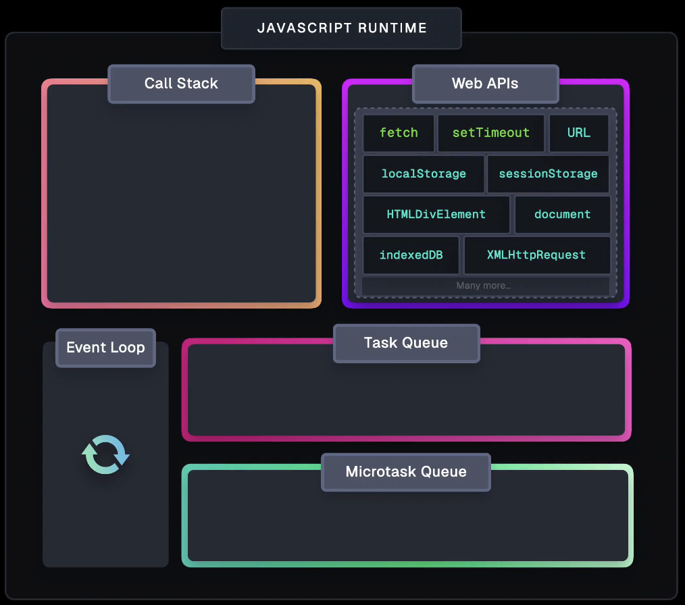

# My_Learning_NodeJS



Learn everything about Javascript/Typescript here.

## About

- Node should not be used in CPU intensive work.

## Installation

### 1. NVM

To manage multiple versions of **Node.js**

- `$ curl -o- https://raw.githubusercontent.com/nvm-sh/nvm/v0.39.1/install.sh | bash`
- list node versions using `$ nvm list`
- Use specific version using `$ nvm use <version_no>` E.g. `$ nvm use 16.13.1`
- Install a specific version of `node` via `nvm install <version_no>` E.g. `$ nvm install 14`

### 2. Node.js (`node` & `npm`)

#### M-1 [RECOMMENDED]

- Install the latest node via `nvm install node`
- Use the latest node via `nvm use node`
- Install the latest _lts_ node via `nvm install --lts`
- Use the latest _lts_ node via `nvm use --lts`

> NOTE: LTS: long term support in terms of stable & secure versions.

#### M-2

- Install Node & npm from [here](https://nodejs.org/en/download/)

> NOTE: Whenever `node` gets installed, `npm` also gets installed.

### 3. Yarn

> Although there are many other alternatives like `pnpm`, `bun`, etc.
>
> `yarn` is relatively faster than `npm` because of **parallel** installation of dependency packages instead of **sequential**.
>
> ~~DON'T USE `npm install -g yarn`~~

With [node.js](#2-nodejs-node--npm) installed, [`corepack`](https://yarnpkg.com/corepack) command is ready to use. Or else, install corepack via `$ npm install -g corepack`.

```sh
corepack enable
```

Now, check:

```sh
$ yarn --version
4.1.1
```

To create a new project:

```sh
yarn init -n PROJECT_NAME
```

Thereafter for a project, `yarn` can be used to install, test, coverage, etc, instead of `npm`.

[Docs](https://yarnpkg.com/)

To setup in Github Action for a repo, refer [this](https://github.com/abhi3700/my_coding_toolkit/blob/master/git_all.md#github-action).

## Features

- `jshint` can be used to get suggestions for better code in `js`.

  - `jshint app.js` can be used like this to find suggestions.
  - M-1: `.jshintrc` file can be added as inline configuration for the entire project in the root directory & adding it this:

  ```json
  {
    "esversion": 6
  }
  ```

  - M-2: Also this line can be added at the starting of the `.js` file. [Source](https://stackoverflow.com/a/35365041/6774636)

## Repositories

### My

- TS boilerplate (bin): <https://github.com/abhi3700/ts-boilerplate-bin>
- TS boilerplate (lib): <https://github.com/abhi3700/ts-boilerplate-lib>

### Others

## Troubleshoot

### 1. `yarn.lock` conflict

- _Cause_: `yarn.lock` file conflicts are not resolved during PR.
- _Solution_: Just copy paste the `yarn.lock` file from the `main` branch & then run `$ yarn install` & then push commit. Your lock file is synced now.

## References

- [Node.js Tutorial for Beginners: Learn Node in 1 Hour](https://youtu.be/TlB_eWDSMt4)
- [Web Developer Roadmap (2024) - Everything is Changing](https://www.youtube.com/watch?v=EzTxYQmU8OE) ✅
- [JavaScript Visualized: Event Loop, Web APIs, (Micro)task Queue](https://www.lydiahallie.com/blog/event-loop) 🌟🌟🌟🌟🌟
  > It has many GIFs and animations to help you understand the Event Loop & more.
