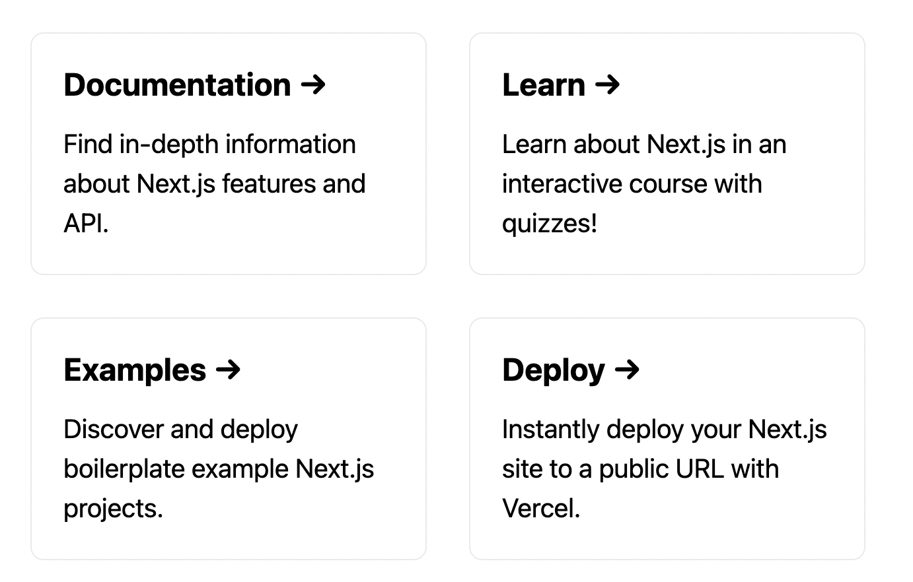

# Learn HTML, CSS

## Coding


```html
<p>
  Edit this index page here {' '}
  <code classname="{styles.code}">pages/index.js</code>
</p>
```

---


```html
<p>
  Check out the API Swagger documentation at <a href="/api/doc">/api-doc</a>
</p>
```

---



```html
<div className="{styles.grid}">
  <a href="https://nextjs.org/docs" className="{styles.card}">
    <h2>Documentation &rarr;</h2>
    <p>Find in-depth information about Next.js features and API.</p>
  </a>

  <a href="https://nextjs.org/learn" className="{styles.card}">
    <h2>Learn &rarr;</h2>
    <p>Learn about Next.js in an interactive course with quizzes!</p>
  </a>

  <a
    href="https://github.com/vercel/next.js/tree/canary/examples"
    className="{styles.card}"
  >
    <h2>Examples &rarr;</h2>
    <p>Discover and deploy boilerplate example Next.js projects.</p>
  </a>

  <a
    href="https://vercel.com/new?utm_source=create-next-app&utm_medium=default-template&utm_campaign=create-next-app"
    className="{styles.card}"
  >
    <h2>Deploy &rarr;</h2>
    <p>Instantly deploy your Next.js site to a public URL with Vercel.</p>
  </a>
</div>
```
