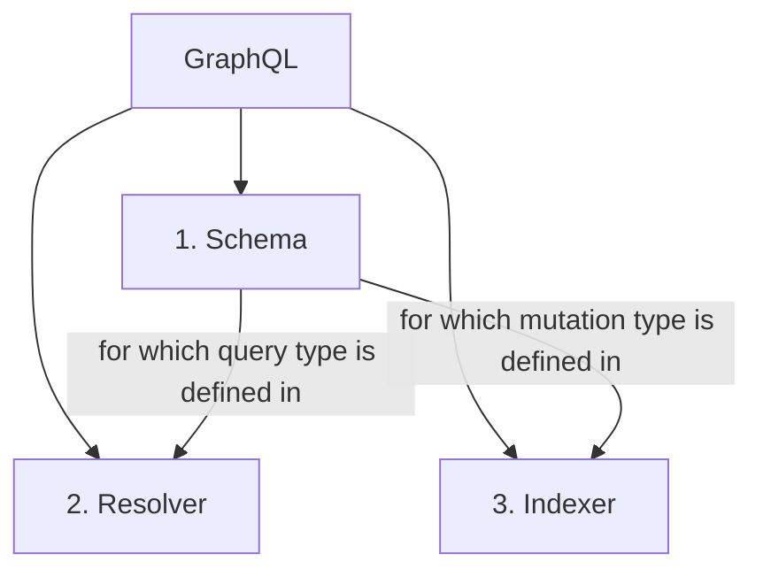
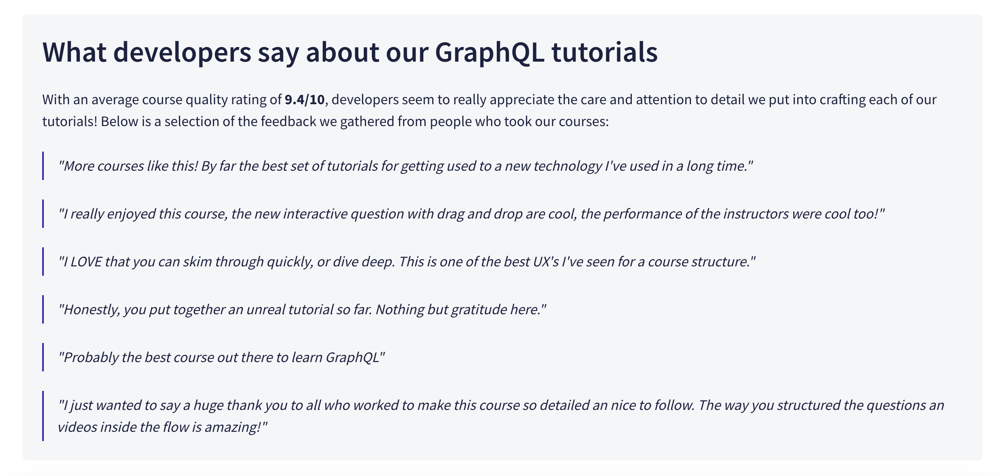

# GraphQL

## About

- It's a language. A schema is like a contract between the server and the client. It defines what a GraphQL API can and can't do, and how clients can request or change data. It's an abstraction layer that provides flexibility to consumers while hiding backend implementation details.
- language: Schema Description Language (SDL)
- To pick the specific data you want.
- 3 parts:
  - schema: define schema for your data type,
  - resolver: define query for your schema,
  - indexer file.

## Concepts



- while defining `input` type, you can define `!` to make it required. So, here courseName, price are required.

```graphql
input CourseInput {
  id: ID
  courseName: String!
  category: String
  price: Int!
  language: String
  email: String
  stack: Stack
  teachingAssists: [TeachingAssist]
}
```

> Unlike Javascript objects (which look very similar), fields are not separated by commas. In addition, we can indicate whether each field value is nullable or non-nullable. If a field should never be null, we add an exclamation mark after its type:

---

Two main packages needed before writing schema for our GraphQL API:

- `graphql`: package provides the core logic for parsing and validating GraphQL queries.
- `apollo-server`: package provides a full-fledged, spec-compliant GraphQL server with some nice utilities like the `gql` template literal that we'll use in a moment.

  - Even though initially the server won't be connected to any data sources yet, it would be great to be able to send the server a test query and get a valid response. Fortunately, `ApolloServer` provides a way to do exactly that, using mocked data.To enable basic mocked data, we could provide `mocks:true` to the `ApolloServer` constructor, like so:

  ```js
  const server = new ApolloServer({
    typeDefs,
    mocks: true,
  });
  ```

  - Advanced level would be provide a `mocks` object to the `ApolloServer` constructor, like so:

  ```js
  const server = new ApolloServer({
    typeDefs,
    mocks,
  });
  const mocks = {
    Query: () => ({
      tracksForHome: () => [...new Array(6)],
    }),
    Track: () => ({
      id: () => "track_01",
      title: () => "Astro Kitty, Space Explorer",
      author: () => {
        return {
          name: "Grumpy Cat",
          photo:
            "https://res.cloudinary.com/dety84pbu/image/upload/v1606816219/kitty-veyron-sm_mctf3c.jpg",
        };
      },
      thumbnail: () =>
        "https://res.cloudinary.com/dety84pbu/image/upload/v1598465568/nebula_cat_djkt9r.jpg",
      length: () => 1210,
      modulesCount: () => 6,
    }),
  };
  ```

  - Now, with our server loaded with mock data, now we can run a query on it to test. In the next lesson, we'll use the Apollo Studio Explorer to build and run test queries seamlessly.

[source](https://www.apollographql.com/tutorials/lift-off-part1/apollo-server)

[Reference](https://www.apollographql.com/tutorials/lift-off-part1/building-our-schema)

---

**`gql`**

- It's a tagged template literal, used for wrapping GraphQL strings like the schema definition we're about to write.
- This converts GraphQL strings into the format that Apollo libraries expect when working with operations and schemas, and it also enables syntax highlighting.

Used like this:

```js
// schema.js
// |- src/
const typeDefs = gql`
  type Query {
    hello: String
  }
`;

module.exports = typeDefs;
```

---

**Query**

How to tell the GraphQL server what to retrieve when we query it. Remember, we don't have multiple specific endpoints to target different types like a REST API does. Instead, we define a special Query type.

```graphql
type Query {
  # Fields go here
}
```

The fields of this type are entry points into the rest of our schema. These are the top-level fields that our client can query for.

---

**Client level**:

2 packages needed:

- `graphql`: provides the core logic for parsing and validating GraphQL queries.
- `@apollo/client`: contains pretty much everything we need to build our client, including an in-memory cache, local state management, and error handling.

> Using `ApolloProvider` is a convenient way to make Apollo Client available everywhere it's needed.

E.g.:

```js
const client = new ApolloClient({
  uri: "http://localhost:4000",
  cache: new InMemoryCache(),
});

ReactDOM.render(
  <ApolloProvider client={client}>
    <GlobalStyles />
    <Pages />
  </ApolloProvider>,
  document.getElementById("root")
);
```

## Example

<!-- Refer to this [learn-graphql](https://github.com/abhi3700/learn-graphql) repo. Watch its commit history to learn via different branches.

[v1: setup with Express](https://github.com/abhi3700/learn-graphql/commit/9b9d17da7f65e8629cb609bccf301c3c6422ad8e)
1. [v2: setup schema for Graphql of course data structure]()
 -->

All these courses are available on Apollo's [GraphQL tutorial](https://www.apollographql.com/tutorials/).

1. Take this [course](https://www.apollographql.com/tutorials/lift-off-part1/).



## References
