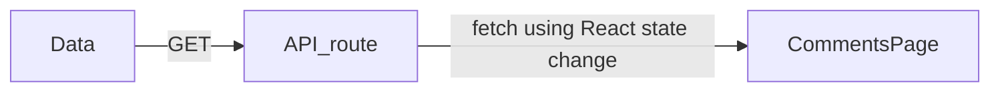

# Next.js

The React Framework for Production

## About

- It simplifies the process of building a react application for production. Basically, it is a full-stack development framework.
- File based routing
- Pre-rendering
- API routes: using next.js for creating APIs
- Support for CSS modules
- Authentication
- Dev and Prod build system
- Pre-requisites:
  - HTML, CSS, Javascript Fundamentals
  - ES6 + features
  - React Fundamentals
- You can write the FE code in React and also write APIs that can be called by the FE code.
- Next.js gives you everything you need to write full-stack React + Node applications.
- From code standpoint this is the code structure for API handler function:

  ```ts
  /**
   * @param req IncomingMessage from client that contains - headers, cookies, HTTP methods
   *     `req.method`, query params (`req.url`), body (data sent from client).
   * @param res ServerResponse from server that contains - headers, cookies,
   *     status code `res.status()`, body (data sent from server) `res.status(200).json({})`.
   */
  export default function handler(req, res) {
    const { param1 } = req.query;

    // a. Split the url by '/' >> b. capture into array >> c. fetch the 2nd last element
    const client = req.url.replaceAll(" ", "").split("/").at(-2);

    if (req.method === "GET") {
      jsonReader(dataFilePath, (err, data) => {
        if (err) {
          // console.log(`${err}`);
          res.status(404).json({ message: `error: ${err}` });
        } else {
          /**
           * "/api/clients/[client]/[param1]"
           * E.g. "/api/clients/pocketworld/encryption_public_key"
           */
          let found = false;

          // loop across the array & find out if the queried client matches with database
          for (let i = 0; i < data.clients.length; ++i) {
            if (data.clients[i].client_comp_name === client) {
              if (data.clients[i].hasOwnProperty(param1)) {
                found = true;
                res.status(200).json(data.clients[i][param1]);
                break;
              }
            }
          }

          // if the queried client is NOT found, display the error message.
          if (!found) {
            res
              .status(404)
              .json({ message: `Sorry! No info found for this API query url` });
          }
        }
      });
    } else {
      res.status(503).json({
        message: `Sorry! no such method \'${req.method}\' is implemented yet.`,
      });
    }
  }
  ```

## Installation

- nvm, nodejs, npm

## Getting Started

**Procedure**:

1. Create project "hello-world" via `$ npx create-next-app <project-name>` (with JS) & `$ npx create-next-app <project-name> --typescript` (with TS)
   > `yarn` lock file is generated. Keep a track of it in case of app unlike libraries.
2. Go to folder: `$ cd <project-name>`
3. Run app: `$ yarn dev`. Check at http://localhost:3000 in browser.

## Comparison with React

- No `start` command in React.
- Uses `react-ui`, `react-dom` as dependencies.

## Routing

### File-based routes


Here, by visiting links:

- http://localhost:3000, we get Home page.
- http://localhost:3000/about, we get About page.
- http://localhost:3000/profile, we get Profile page.

### Nested routes

Nested routing


Here, by visiting links:

- http://localhost:3000/blog, we get Blog page.
- http://localhost:3000/blog/first, we get First Blog page.
- http://localhost:3000/blog/second, we get Second Blog page.

We can modify like this by moving `blog.js` to `blog/` folder & then rename it to `index.js`


Now, it looks better.

### Dynamic routes

Target:


In order to obtain this, we can do like this:


But, what to do in case of 100 products? So, this method is not feasible.


Now, if we want to go into a dedicated product name inside `product/` folder, then


### Nested Dynamic Routes


**Step-1**: To replace `[productId].js` with folder & `index.js`
Before:

```console
.
├── [productId].js
├── index.js
└── sweater.js
```

After:

```console
.
├── [productId]
│   └── index.js
├── index.js
└── sweater.js
```

**Step-2**: Create `[review]` folder & a query related dynamic route file called `[reviewId].js`.


Now, we can have any review id for any product id like this:


### Catch All Routes


Here, in order to not have so many files for so many nested & dynamic files, we have only 1 file `[[...params]].js`.


## Pre-rendering

<!-- TODO -->

## API routes

- **Handle GET requests**
- **Handle POST requests**
- **Dynamic API routes**
- **Handle DELETE requests**
- **Catch all API routes**

Within the `pages/` folder, you need to create a folder called `api/`. Within the `api/` folder, you can define all the APIs for your application.

You can add business logic without needing to write any additional custom server code and without having to configure any API routes.

For this, a fresh project `next-api` is created [here](./next-api/).

Then, delete these files:

- `pages/index.js`
- `pages/api`
- `styles/Home.module.css`

Now, create `pages/api/index.js` with this code & run `$ yarn dev`


### API GET Request

Have some data in `data/` folder in order to fetch those.

> Here, for simplification, the `data/` folder is considered as database.

And create a `handler` function in `index.js` of `comments/` folder.

Do this:


Now, fetch the comments by clicking a button

1. Create a `comments/` folder outside `api/` folder & then create a `index.js` file inside.
2. Then edit the `index.js` with the code inside.

```js
import { useState } from "react";

export default function CommentsPage() {
  // initial state is empty array
  // `comments` is replaced by the `setComments` value
  const [comments, setComments] = useState([]);

  const fetchComments = async () => {
    const response = await fetch("api/comments");
    const data = await response.json();
    setComments(data); // blank is replaced by data fetched
  };
  return (
    <>
      <button onClick={fetchComments}>Load Comments</button>
      {comments.map((comment) => {
        return (
          <div key={comment.id}>
            {comment.id} {comment.text}
          </div>
        );
      })}
    </>
  );
}
```

3. Create a button "Load Comments" with blank
4. Create a button "Load Comments" with comments fetched from data using API



**Before**:


---

**After**:


### API POST Request

1. Add this code to `pages/comments/index.js` inside:
   
2. Add this code to `pages/api/comments/index.js` inside:
   
3. Get this when `Submit comment` is pressed:
   
4. Finally, get this when `Load comments` is pressed:
   

### API Dynamic routes

Here, if we want to

1. create a `[commentId].js` file in `comments/` folder, put inside:
   
2. View comment-1 on browser:
   
3. View on browser for comment-4. Nothing is shown as it doesn't exist:
   

### API DELETE routes

1. Edit the `pages/comments/index.js` in order to show the <kbd>DELETE</kbd> button for each comment
   
2. Edit the `pages/api/comments/[commentId].js` in order to edit the API location after deleting
   
3. Show the Comments page:
   
4. After deleting the 3rd comment
   
5. After deleting the 1st comment
   
6. After adding a comment & load
   
7. loading after deleting the test comment
   

## References

- [Next.js Tutorial for Beginners](https://www.youtube.com/playlist?list=PLC3y8-rFHvwgC9mj0qv972IO5DmD-H0ZH)
