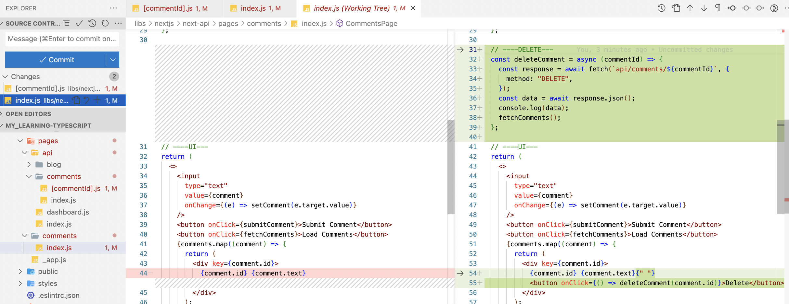

# Next.js

The React Framework for Production.

## Overview

Watch this [video](https://youtu.be/wm5gMKuwSYk?si=O8PtqA_-lxbNaxz1&t=213) 📹 to understand its benefits.

- It simplifies the process of building a react application for production. Basically, it is a full-stack development framework that allows you to build server-side rendered (SSR) React applications with ease.
- What does SSR or serverless architecture mean?
  - SSR means that the HTML of your application is generated on the server instead of the client. This is useful for SEO purposes and also for performance reasons.
  - In a serverless setup, your API routes are deployed as serverless functions. This means each API route is its own independent function, which gets executed in response to an HTTP request. Serverless does not mean there is no server; rather, it means that the server management and infrastructure scaling are handled automatically by the cloud platform, and you are charged based on the actual usage (i.e., the number of requests).
- **Server-Side Rendering (SSR) and Static Site Generation (SSG)**: Next.js excels in offering both SSR and SSG. This means you can pre-render pages at build time (SSG) or on each request to the server (SSR), which can significantly improve performance and SEO.
- **Hybrid Pages**: Next.js allows for hybrid applications, where you can use static generation for some pages and server-side rendering for others within the same application. This flexibility is a significant advantage.
- **API Routes**: It's worth emphasizing that API routes in Next.js allow you to create server-side API endpoints as part of your Next.js app. They can be used to handle things like form submissions, database queries, etc., without the need for a separate backend server.
- **Built-in CSS and Sass Support**: Next.js comes with built-in support for CSS and Sass, which allows for component-level styles using CSS Modules. This makes styling more manageable and modular.
- **Image Optimization**: Next.js provides an Image component out of the box that optimizes images automatically. This feature helps with performance improvements and better user experience.
- **Fast Refresh**: Next.js supports fast refresh, a feature that gives you instant feedback on edits you make to your React components. This makes the development experience smoother and more efficient.
- **TypeScript Support**: Next.js offers built-in support for TypeScript, allowing for type-safe codebases, which can enhance code quality and developer experience.
- **Customizable Babel and Webpack Configuration**: While Next.js works out of the box with sensible defaults, it also allows for custom configuration of Babel and Webpack, giving developers more control over the build process.
- **Routing Enhancements**: Next.js offers features like dynamic routes, catch-all routes, and shallow routing, providing powerful and flexible routing capabilities.
- **Internationalization**: Built-in internationalization routing and language detection is another powerful feature of Next.js, making it easier to create multi-language websites.
- **Community and Ecosystem**: Next.js has a strong community and ecosystem, with a wide range of plugins and integrations available, making it a robust choice for building modern web applications.
- Pre-requisites for learning Next.js, although not so important if you are building APIs:
  - HTML, CSS, Javascript Fundamentals
  - ES6 + features
  - React Fundamentals
- You can write the FE code in React and also write API routes that can be called by the FE code using `fetch`
- Next.js gives you everything you need to write full-stack React + Node applications.

---

But, there are some key facts to be kept in mind while using Next.js:

- **Accessing API Routes**: Though you can't directly call functions in API routes from client-side code (like you would with regular JavaScript functions), you can interact with these routes using HTTP requests (e.g., using `fetch` or `axios`). Essentially, they are endpoints of a web server, and you communicate with them using HTTP methods like GET, POST, PUT, DELETE, etc. For testing APIs, `curl` can be used on terminal, `Postman` can be used on browser, `Thunder Client` can be used on VSCode.
- **Stateless Nature**: Serverless functions are typically stateless. They handle a request, provide a response, and do not retain any state between requests. This is ideal for stateless HTTP requests where each request is independent.- **Isomorphic Code**: In Next.js, you can write code that runs both on the server and the client (like `getInitialProps` or `getServerSideProps` in pages). However, API routes are strictly server-side.
- **Deployment Consideration**: When you deploy a Next.js app, your API routes are deployed as serverless functions (if supported by the platform) or as part of a Node.js server. This is handled automatically by Next.js.
- **Not Part of Client Bundle**: The code you write in API routes doesn't become part of the JavaScript bundle that gets sent to the browser. This helps in keeping the client-side bundle size smaller.
- **Security**: Since API routes run on the server, they are a secure place to handle sensitive operations like authentication or direct database access. You can include secrets or perform operations you wouldn't want to expose to the client.
- **Server-Side Execution**: API routes in Next.js are designed to run on the server. This means that any logic in these routes, such as database queries or external API calls, is executed on the server and not on the client's browser.

## Installation

Ensure `nvm`, `node`, `npm` are installed.

## Getting Started

### API routes

1. Just clone this [repo](https://github.com/abhi3700/nextjs-api-boilerplate) & make it yours.
2. Run `$ yarn dev` to start the development server & call API routes using `curl` like this:

    

3. Add more API routes in `pages/api/` folder.
4. Deploy to Vercel:
   1. Login with Github account.
   2. Import your github repo.
   3. Deploy.
   4. Access the API routes at the deployed link.

### Full Stack Application

Follow the steps for creating a full stack application with Next.js:

1. Create project "hello-world"

   - with JS: `$ npx create-next-app <project-name> --use-yarn`
   - with TS: `$ npx create-next-app <project-name> --use-yarn --typescript`

```sh
$ npx create-next-app hello-world --use-yarn --typescript
Need to install the following packages:
create-next-app@14.1.0
Ok to proceed? (y) y
✔ Would you like to use ESLint? … No / Yes✅
✔ Would you like to use Tailwind CSS? … No✅ / Yes
✔ Would you like to use `src/` directory? … No✅ / Yes
✔ Would you like to use App Router? (recommended) … No / Yes✅
✔ Would you like to customize the default import alias (@/*)? … No✅ / Yes
```

2. Go to folder: `$ cd hello-world`
3. Build: `$ yarn build`. This will create a `.next/` folder.

```sh
Route (app)                               Size     First Load JS
┌ ○ /                                     5.29 kB        89.5 kB
└ ○ /_not-found                           885 B          85.1 kB
+ First Load JS shared by all             84.2 kB
  ├ chunks/69-1b6d135f94ac0e36.js         28.9 kB
  ├ chunks/fd9d1056-cc48c28d170fddc2.js   53.4 kB
  └ other shared chunks (total)           1.9 kB

Route (pages)                             Size     First Load JS
─ λ /api/health                           0 B            78.8 kB
+ First Load JS shared by all             78.8 kB
  ├ chunks/framework-aec844d2ccbe7592.js  45.2 kB
  ├ chunks/main-99238e5788d9f0c5.js       31.7 kB
  └ other shared chunks (total)           1.87 kB

○  (Static)   prerendered as static content
λ  (Dynamic)  server-rendered on demand using Node.js
```

Let's decypher the static vs dynamic here. **static** means that the page is pre-rendered at build time and **dynamic** means that the page is rendered on-demand in the browser. API routes are mostly dynamic as their output (executed via function) depends on the request body or query params.

Like `pages/api/user/[id].ts` is considered as dynamic route, whereas `pages/api/health.ts` is considered as static route as the content is not dependent on any request body or query params.

## Coding

All the API routes are stored in `pages/api/` folder.

- **API routes are server-side only**. You won't be able to access them from the client-side.

- From code standpoint, this is the code structure for API handler function:

```ts
export default async function handler(
  req: NextApiRequest,
  res: NextApiResponse<ResponseData | { error: string }>,
) {
  // Ensure we're dealing with a GET request
  if (req.method !== 'GET') {
    res.setHeader('Allow', ['GET']);
    res.status(405).end(`Method ${req.method} Not Allowed`);
  }

  try {
    const { address } = req.query;

    const result = await viewNovaBalanceOf(PROVIDER, address as string);

    if (result.error) {
      return res.status(500).json({ error: result.error });
    }

    const balanceResponse: BalanceResponse = {
      address: address as string,
      balance: result.balance.toString(),
    };
    res.status(200).json({
      code: 200,
      status: 'Ok',
      result: balanceResponse,
    });
  } catch (error) {
    res.status(500).json({ error: 'Internal Server Error' });
  }
}
```

### Comparison with React

- No `start` command in React.
- Uses `react-ui`, `react-dom` as dependencies.

## Routing

### File-based routes


Here, by visiting links:

- <http://localhost:3000>, we get Home page.
- <http://localhost:3000/about>, we get About page.
- <http://localhost:3000/profile>, we get Profile page.

Suppose, a page when rendered needs to automatically switch to a different layout/page. In this case, use `useRouter()` from `next/navigation` like this:

```tsx
import { useRouter } from 'next/navigation'

//...
router.push('/deposit')
//...
```

<details><summary><b>Full Code:</b></summary>

```tsx
function MetamaskButton() {
  const account = useAccount()
  const { connect, connectors, status, error } = useConnect()
  const router = useRouter()

  // Redirect if already connected
  useEffect(() => {
    if (account.isConnected) {
      router.push('/deposit')
  }, [account.isConnected, router])

  const handleOnClick = async () => {
    if (typeof window.ethereum !== 'undefined') {
      const metaMaskConnector = connectors.find(
        connector => connector.name === 'MetaMask',
      )

      if (metaMaskConnector) {
        connect({ connector: metaMaskConnector })
        if (account.status === 'connected') {
          console.log(
            `${JSON.stringify(account.addresses[0])} connected to ${account.chainId}`,
          )
        }
      }
    } else {
      window.open('https://metamask.io/', '_blank')
    }
  }

  return (
    <Button
      color="orange"
      _hover={{ bg: 'orange.600' }} // Darker on hover for better interaction feedback
      px={12}
      py={8}
      fontSize="1em"
      bgColor="white"
      borderRadius="1em"
      boxShadow="0 4px 12px rgba(0,0,0,0.25)"
      leftIcon={<MetamaskIcon width="1em" height="1em" />}
      onClick={handleOnClick}>
      <b>Connect with METAMASK</b>
    </Button>
  )
}

export default function App() {
  return (
    <Flex direction="column" align="center" justify="center" height="100vh">
      <MetamaskButton />
    </Flex>
  )
}
```

> Here, the current page is automatically rendered to the desired page (`/deposit`).

</details>

### Nested routes

Nested routing


Here, by visiting links:

- <http://localhost:3000/blog>, we get Blog page.
- <http://localhost:3000/blog/first>, we get First Blog page.
- <http://localhost:3000/blog/second>, we get Second Blog page.

We can modify like this by moving `blog.js` to `blog/` folder & then rename it to `index.js`


Now, it looks better.

### Dynamic routes

Target:


In order to obtain this, we can do like this:


But, what to do in case of 100 products? So, this method is not feasible.


Now, if we want to go into a dedicated product name inside `product/` folder, then


### Nested Dynamic Routes


**Step-1**: To replace `[productId].js` with folder & `index.js`
Before:

```console
.
├── [productId].js
├── index.js
└── sweater.js
```

After:

```console
.
├── [productId]
│   └── index.js
├── index.js
└── sweater.js
```

**Step-2**: Create `[review]` folder & a query related dynamic route file called `[reviewId].js`.


Now, we can have any review id for any product id like this:


### Catch All Routes


Here, in order to not have so many files for so many nested & dynamic files, we have only 1 file `[[...params]].js`.


## Pre-rendering

<!-- TODO -->

## API routes

- **Handle GET requests**
- **Handle POST requests**
- **Dynamic API routes**
- **Handle DELETE requests**
- **Catch all API routes**

Within the `pages/` folder, you need to create a folder called `api/`. Within the `api/` folder, you can define all the APIs for your application.

You can add business logic without needing to write any additional custom server code and without having to configure any API routes.

For this, a fresh project `next-api` is created [here](./next-api/).

Then, delete these files:

- `pages/index.js`
- `pages/api`
- `styles/Home.module.css`

Now, create `pages/api/index.js` with this code & run `$ yarn dev`


### API GET Request

Have some data in `data/` folder in order to fetch those.

> Here, for simplification, the `data/` folder is considered as database.

And create a `handler` function in `index.js` of `comments/` folder.

Do this:


Now, fetch the comments by clicking a button

1. Create a `comments/` folder outside `api/` folder & then create a `index.js` file inside.
2. Then edit the `index.js` with the code inside.

```js
import { useState } from "react";

export default function CommentsPage() {
  // initial state is empty array
  // `comments` is replaced by the `setComments` value
  const [comments, setComments] = useState([]);

  const fetchComments = async () => {
    const response = await fetch("api/comments");
    const data = await response.json();
    setComments(data); // blank is replaced by data fetched
  };
  return (
    <>
      <button onClick={fetchComments}>Load Comments</button>
      {comments.map((comment) => {
        return (
          <div key={comment.id}>
            {comment.id} {comment.text}
          </div>
        );
      })}
    </>
  );
}
```

3. Create a button "Load Comments" with blank
4. Create a button "Load Comments" with comments fetched from data using API


**Before**:


---

**After**:


### API POST Request

1. Add this code to `pages/comments/index.js` inside:
   
2. Add this code to `pages/api/comments/index.js` inside:
   
3. Get this when `Submit comment` is pressed:
   
4. Finally, get this when `Load comments` is pressed:
   

### API Dynamic routes

Here, if we want to

1. create a `[commentId].js` file in `comments/` folder, put inside:
   
2. View comment-1 on browser:
   
3. View on browser for comment-4. Nothing is shown as it doesn't exist:
   

### API DELETE routes

1. Edit the `pages/comments/index.js` in order to show the <kbd>DELETE</kbd> button for each comment
   
2. Edit the `pages/api/comments/[commentId].js` in order to edit the API location after deleting
   
3. Show the Comments page:
   
4. After deleting the 3rd comment
   
5. After deleting the 1st comment
   
6. After adding a comment & load
   
7. loading after deleting the test comment
   

## Troubleshoot

### 1. NextRouter was not mounted Next.JS

- _Cause_: Use of `next/router` instead of `next/navigation` as per NextJS v14.
- _Solution_: Use `next/navigation` instead of `next/router`.

Before:

```tsx
import { useRouter } from 'next/router'
```

After:

```tsx
import { useRouter } from 'next/navigation'
```

## References

- [Next.js 14 Full Course 2024 | Build and Deploy a Full Stack App Using the Official React Framework](https://www.youtube.com/watch?v=wm5gMKuwSYk) 🧑🏻‍💻
- [Next.js Tutorial for Beginners YT playlist](https://www.youtube.com/playlist?list=PLC3y8-rFHvwgC9mj0qv972IO5DmD-H0ZH)
- [Next.js 14 Tutorial YT playlist](https://www.youtube.com/playlist?list=PLC3y8-rFHvwjOKd6gdf4QtV1uYNiQnruI)
- [Introduction to Next.js and React](https://www.youtube.com/watch?v=h2BcitZPMn4)
