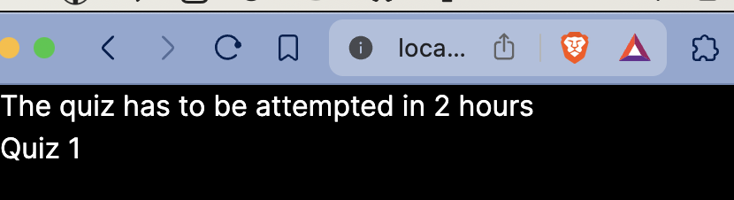
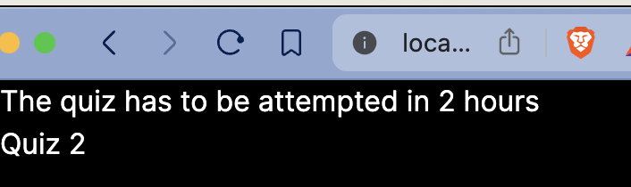

# NextJS React Course 2

> Recommended to look at [part-1](../next-react-course/) first.

**Source**: [Introduction to Next.js and React](https://www.youtube.com/watch?v=h2BcitZPMn4). Watched till [33:47] time. After that fetching data from postgres started. So, watch later.

## Getting Started

> bun is used.

1. Start with project template:

```sh
❯ npx create-next-app next-react-course-2 --use-bun --typescript                                                                                           ⏎
Need to install the following packages:
create-next-app@14.2.3
Ok to proceed? (y) y
✔ Would you like to use ESLint? … No✅ / Yes
✔ Would you like to use Tailwind CSS? … No / Yes✅
✔ Would you like to use `src/` directory? … No✅ / Yes
✔ Would you like to use App Router? (recommended) … No / Yes✅
✔ Would you like to customize the default import alias (@/*)? … No✅ / Yes
Creating a new Next.js app in /Users/abhi3700/F/coding/github_repos/My_Learning_NodeJSTS/libs/nextjs/next-react-course-2.

Using bun.

Initializing project with template: app-tw 


Installing dependencies:
- react
- react-dom
- next

Installing devDependencies:
- typescript
- @types/node
- @types/react
- @types/react-dom
- postcss
- tailwindcss

bun install v1.1.3 (2615dc74)

 + @types/node@20.12.7
 + @types/react@18.3.1
 + @types/react-dom@18.3.0
 + postcss@8.4.38
 + tailwindcss@3.4.3
 + typescript@5.4.5
 + next@14.2.3
 + react@18.3.1
 + react-dom@18.3.1

 131 packages installed [2.54s]
Success! Created next-react-course-2 at /Users/abhi3700/F/coding/github_repos/My_Learning_NodeJSTS/libs/nextjs/next-react-course-2
```

> We could remove tailwind, but kept just to see things for learning. This could be removed by selecting 'No' to tailwind during installation.
> Instead we could use built-in component libs like chakra-ui/flowbite.

2. Run the development server:

```bash
bun dev
```

Open [http://localhost:3000](http://localhost:3000) with your browser to see the result.
3. Do some cleaning of the `package.json` by keeping what is required here.
4. Now, try playing with it. like if you open `http://localhost:3000/next.svg`, then u get to see the nextjs logo, same for `vercel.svg` or whatever res in `public/` folder.

## Concepts

- `public/` dir is for accessing files publicly like logos on our nextjs server.
- `.next/` dir is locally generated when built.
- `pages/` dir or pages router. But no more used since Nextjs 13.
- `app/` dir or app router.
- Instead of using link tag `<a></a>`, use `<Link></Link>` of nextjs. It's pretty fast. Basically, on clicking on the link, it will go to the specified page without loading the page again. This acts like an unified app (kind of like in mobile app screens). `<Link></Link>` is supposed to be used for loading internal links like pages here. But, for external links, still `<a></a>` is used.
- In dynamic routes like:

Eg-1: 1 object field
```sh
pages/
  quiz/
    [id]/page.tsx
```
the function would be like this:

```tsx
export default function Page({ params }: { params: { id: string } }) {
    return (
        <div>
            <h1>Quiz {params.id}</h1>
        </div>
    );
}
```

Here, the `Page` component expects to receive a prop object with a single key `params`, which (here) is an object with `id` of type `string`. So, the prop object actually contains a `params` object that looks like this (in this case):

```ts
{ params: { id: string } }
```

Eg-2: 2 object fields
```sh
pages/
  quiz/
    [id]/
      [title].tsx
```
> Inside `[title]`, the file name could also be `page.tsx` instead of `[title].tsx`.

the function would be like this:

```tsx
export default function Page({ params }: { params: { id: string; title: string } }) {
    return (
        <div>
            <h1>Quiz {params.id}</h1>
            <h2>{params.title}</h2>
        </div>
    );
}
```

- Nested layout: Setting a common layout for all quiz pages. Added [layout.tsx](./app/quiz/layout.tsx) which looks like this:





You can notice there is a common layout for all quiz pages.
