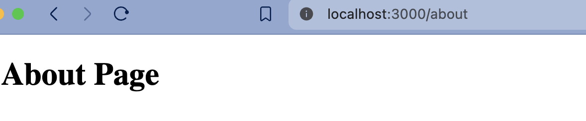
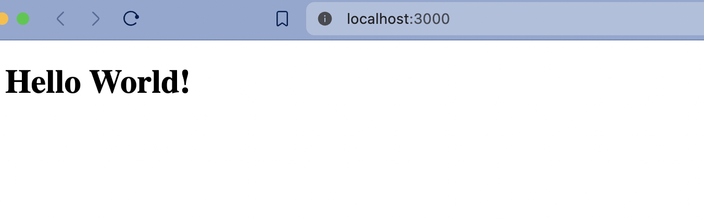
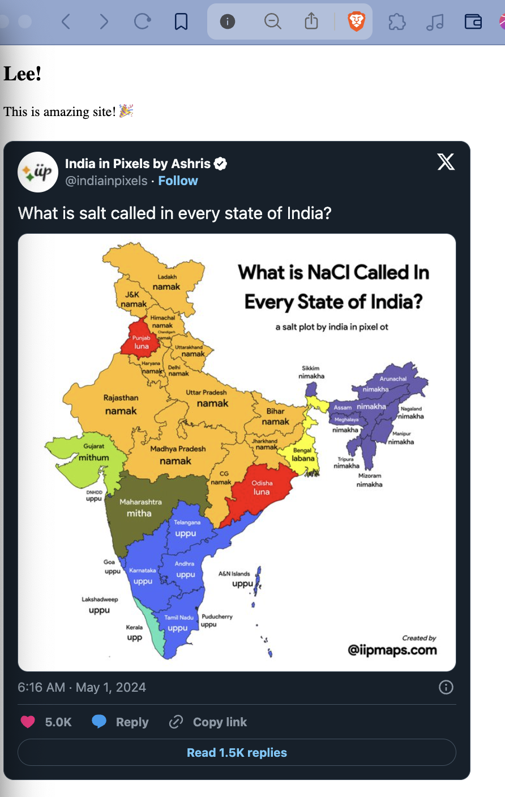

# Next React Course

Learn from scratch. Not using any boilerplate, but started with `npm init -y` and `bun i next react react-dom`.

**Source**: [Introduction to Next.js and React](https://www.youtube.com/watch?v=h2BcitZPMn4)

## Getting Started

<u>Instructions</u>:

1. `$ npm init -y`
2. `$ bun i next react react-dom`
   > You can use any package manager - yarn, pnpm, npm, bun. I chose bun (personal preference).
3. Inside `package.json`, do some cleanup, but leave `scripts`. And add script with `next dev --turbo`. Now, run `$ bun dev`.
   > `--turbo` flag is for faster development.
4. Create a folder `app/`. Inside, add 2 files: `layout.js`, `page.js` and some code there.
   > If you are thinking what is this `app/` folder? Previously in NextJS 12, it was `pages/`. So, from v13 onwards, it is `app/`.
    You could try `pages/`. Create a `about.js` with this code:

    ```js
    export default function Page() {
        return <h1>About Page</h1>;
    }
    ```

    Now, run `$ bun dev`. You should see something like this:
    

    But, the focus here is to follow the new standard.

5. `$ bun run dev`:

    CLI:

    ```sh
    bun run dev
    $ next dev
    ▲ Next.js 14.2.3
    - Local:        http://localhost:3000

    ✓ Starting...
    ✓ Ready in 2.8s
    ○ Compiling / ...
    ✓ Compiled / in 1199ms (433 modules)
    GET / 200 in 1303ms

    ```

    Browser:
    

6. You could add components from external dependencies like `react-tweet` to embed tweets. Just `bun i react-tweet`. And then in the `page.js`, add this code:

```diff
import { Header } from "./header";
+ import { Tweet } from "react-tweet";

export default function Page() {
    return (
        <section>
            <Header>
                <h1>Lee!</h1>
            </Header>
            <p>This is amazing site! 🎉</p>
+            <Tweet id="1785470824826159489"></Tweet>
        </section>
    );
}
```

7. Run `$ bun run dev` again. You should see something like this:



## Concepts

Below are some concepts that I learned during this course.

- If a function is exported as `default`, then import without `{}`. E.g.

```js
// header.js
export default function Header() {
    return <h1>Header</h1>;
}

// page.js
import Header from './header';
```

- If a function is exported as named, then import with `{}`. E.g.

```js
// header.js
export function Header() {
    return <h1>Header</h1>;
}

// page.js
import { Header } from './header';
```

## Conclusion

Now, you are ready to follow the standard way to kickstarting a NextJS project 🎉.
