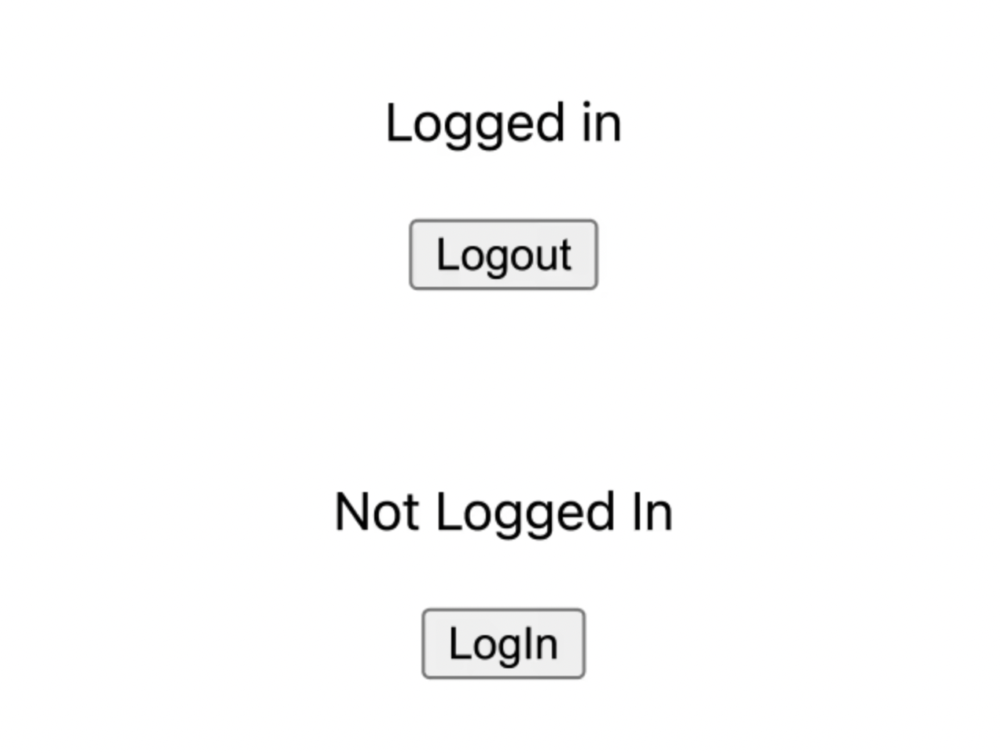
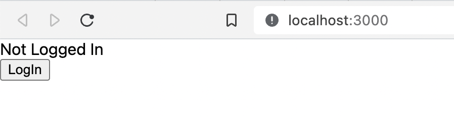
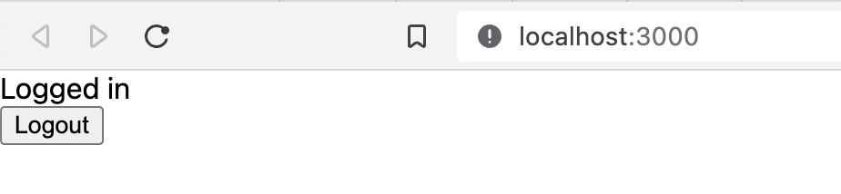
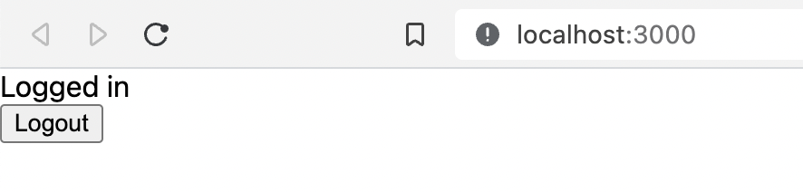

# NextJS with Redux

This is a [Next.js](https://nextjs.org/) project bootstrapped with [`create-next-app`](https://github.com/vercel/next.js/tree/canary/packages/create-next-app).

## Getting Started

First, run the development server:

```bash
npm run dev
# or
yarn dev
```

Open [http://localhost:3000](http://localhost:3000) with your browser to see the result.

You can start editing the page by modifying `pages/index.tsx`. The page auto-updates as you edit the file.

[API routes](https://nextjs.org/docs/api-routes/introduction) can be accessed on [http://localhost:3000/api/hello](http://localhost:3000/api/hello). This endpoint can be edited in `pages/api/hello.ts`.

The `pages/api` directory is mapped to `/api/*`. Files in this directory are treated as [API routes](https://nextjs.org/docs/api-routes/introduction) instead of React pages.

## Learn More

To learn more about Next.js, take a look at the following resources:

- [Next.js Documentation](https://nextjs.org/docs) - learn about Next.js features and API.
- [Learn Next.js](https://nextjs.org/learn) - an interactive Next.js tutorial.

You can check out [the Next.js GitHub repository](https://github.com/vercel/next.js/) - your feedback and contributions are welcome!

## Deploy on Vercel

The easiest way to deploy your Next.js app is to use the [Vercel Platform](https://vercel.com/new?utm_medium=default-template&filter=next.js&utm_source=create-next-app&utm_campaign=create-next-app-readme) from the creators of Next.js.

Check out our [Next.js deployment documentation](https://nextjs.org/docs/deployment) for more details.

## Add-ons

### Redux

Redux is a state management tool for React components.

> It's very much preferred by the companies to use Redux for state management.

> In many projects, speed is often a priority. Many React developers are already familiar with Redux, and companies often want to use the same tool across all of the projects if possible.

> This means even if you are working in a company that is building a new project in Next, you might be forced to use Redux anyway, so it’s a good idea to learn how to use it based on popularity alone.

---

The objective here is to show how to use Redux with NextJS via login/logout tracking.



It tracks if a user is logged in or not, then based on the state, changes the text above the button.

---

2 options for integration of Redux:

- [Redux Toolkit](https://redux-toolkit.js.org/) [**Recommended**]
- plain Redux

Using `yarn`:

```console
$ yarn add @reduxjs/toolkit react-redux
```

### SSR

Server Side Rendering. The server renders the page and sends the HTML to the client. The client then receives the HTML and renders it.

Here, the load is given off to the server. When the server does the rendering, the JS code is also downloaded in the background. And that saves a lot of time unlike the case where HTML, CSS, and JS being downloaded sequentially.

For NextJS projects, this is the package: `next-redux-wrapper` using `yarn`:

```console
$ yarn add next-redux-wrapper
```

## Testing

Here, we test the app if running as per the objective set.

---

Initial state when the app is loaded:



---

After clicking the <kbd>Login</kbd> button:



---

After clicking the <kbd>Logout</kbd> button:



## References

- [NextJS with Redux](https://blog.logrocket.com/use-redux-next-js/)
