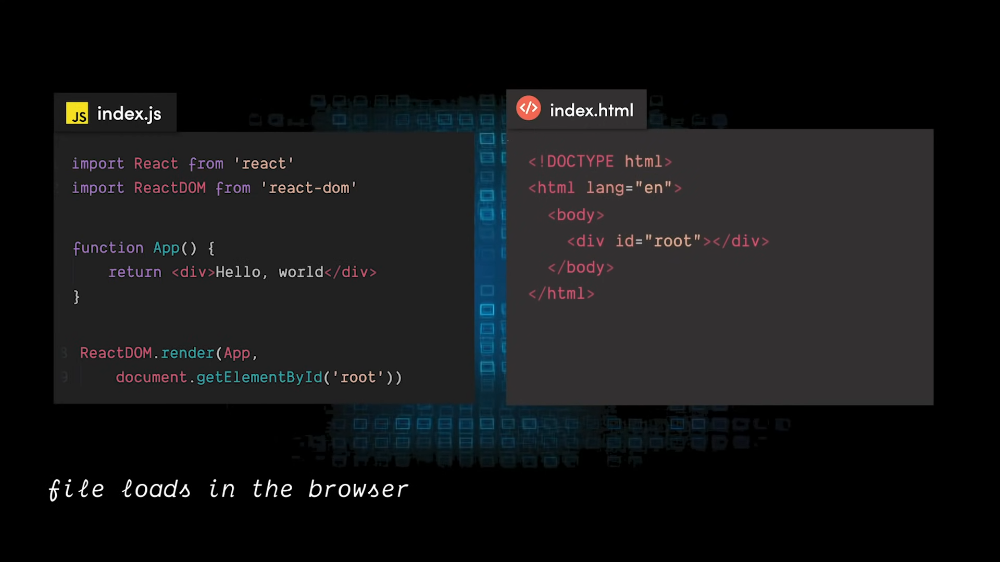
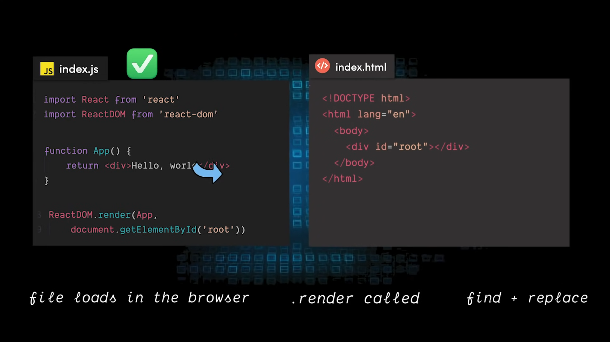
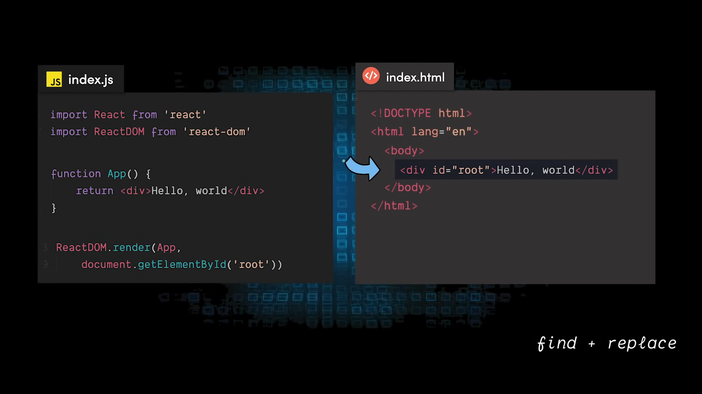
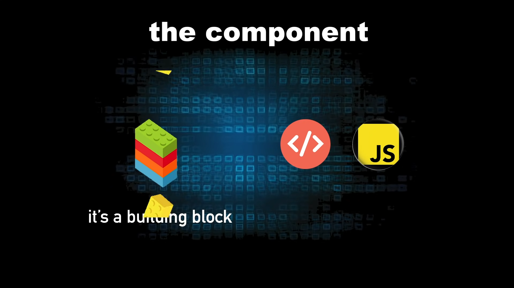
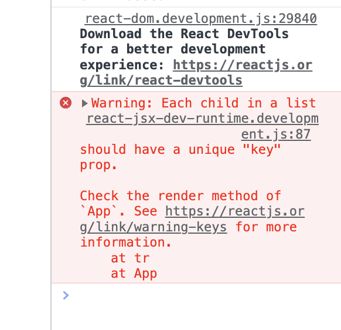

# React

Learn everything about React here.

## Overview

- Default library/framework for building web applications.
  > Best use case: <kbd>React FE + NextJS BE</kbd>
- React components are JavaScript functions that return markup.
- React creates a VIRTUAL DOM in memory.
  > Instead of manipulating the browser's DOM directly, React creates a virtual DOM in memory, where it does all the necessary manipulating, before making the changes in the browser DOM.
- React only changes what needs to be changed!
  > React finds out what changes have been made, and changes only what needs to be changed.

## Installation

- `nvm`, `npm`, `node`, `yarn` (in sequence)
- Add a React project using `$ npx create-react-app my-app` (where `my-app` is the name of your project).
  > Don't install `create-react-app` globally.
- Add prettier to your project using `$ npm install --save-dev prettier`.
  - single-quote: `true`
  - semi: `true` (depends on project to project)

## My Apps

Learn about each of my apps in the "**About**" section.

1. [My App](./my-app/README.md)
2. [Starting React](./starting-react/README.md)

## Getting Started

- Run `$ npm start` to start the development server.
- Run `$ npm run build` to create a production build.
- Deploy the build folder to a static hosting service like **Netlify** or **Vercel**.

## Concepts

### How it works

1. Step-1: Loads the `index.html` file.
   
2. Step-2: finds the root element with `id="root"`.
   

3. Step-3: Then, `.render` is called on the `ReactDOM` object.
   

4. Step-4: trying to replace everything inside App into the root element.
   

### File structure

```console
❯ tree -I node_modules
.
├── README.md
├── package-lock.json
├── package.json
├── public
│   ├── favicon.ico
│   ├── index.html
│   ├── logo192.png
│   ├── logo512.png
│   ├── manifest.json
│   └── robots.txt
└── src
    ├── App.css
    ├── App.js
    ├── App.test.js
    ├── index.css
    ├── index.js
    ├── logo.svg
    ├── reportWebVitals.js
    └── setupTests.js
```

### Imports

These are the imports you need to use React.

```jsx
import React from "react";
import ReactDOM from "react-dom";
```

### Execute

```jsx
// define function
function App() {
  return <h1>Hello World to `my-app`</h1>;
}

// execute function
ReactDOM.render(App, document.getElementById("root"));
```

### Component

Component are the building blocks of React apps. They have JSX (JS XML) markup and JavaScript logic.

A component can contain components & it goes recursively.




---

**JSX** is stricter than **HTML**. You have to close tags like `<br />`. Your component also can’t return multiple **JSX** tags. You have to wrap them into a shared parent, like a `<div>...</div>` or an empty `<>...</>` wrapper.

---

If you add a **classname** to a component, you have to use add the style for the same in the CSS file (with same name like for `App.js`, `App.css`).

> `class` is replaced by `className` in JSX. So, here my-button is the className which is defined in the CSS filename same as the JS filename.

```jsx
// App.js
function MyButton() {
  return <button className="my-button">My Button</button>;
}

function App() {
  return (
    <div>
      <h1>Hello World to `my-app`</h1>
      <MyButton />
    </div>
  );
}
```

```css
/* App.css */
.my-button {
  background-color: #4caf50; /* Green */
  border: none;
  color: white;
  padding: 15px 32px;
  text-align: center;
  text-decoration: none;
  display: inline-block;
  font-size: 16px;
  margin: 4px 2px;
  cursor: pointer;
}
```

---

The style can be used in JSX when your styles depend on JS variables.

```jsx
// App.js

```

---

The information you pass down like this is called **props**. Now the MyApp component contains the count state and the handleClick event handler, and passes both of them down as props to each of the buttons.

Finally, change MyButton to read the props you have passed from its parent component:

```jsx
// App.js
// props: count, onClick
function MyButton({ count, onClick }) {
  return <button onClick={onClick}>Clicked {count} times</button>;
}
```

---

Each child in a list should have a unique `key` prop.

otherwise, it will throw error like this:



Solution:

```jsx
// App.js
function MyList() {
  const list = ["a", "b", "c"];
  return (
    <ul>
      {list.map((item) => (
        <li key={item}>{item}</li>
      ))}
    </ul>
  );
}
```

## Tools

- [BuilderX](https://builderx.io/app/): No-code React UI builder like Android Studio.
- [Anima App](https://www.animaapp.com/): Alternative to BuilderX.
- [Locofy.ai](https://www.locofy.ai/): Create React apps with no code. Just import your design and get a React FE code.

## References

### Education

- [React](https://facebook.github.io/react/)
- [Learn React](https://beta.reactjs.org/learn)
- [React + TS](https://youtube.com/playlist?list=PLNqp92_EXZBJ4CBroxVBJEpAXoz1g-naZ)

### Libraries

- [Awesome React Components](https://github.com/brillout/awesome-react-components)
- [CogoToast](https://cogoport.github.io/cogo-toast/)
