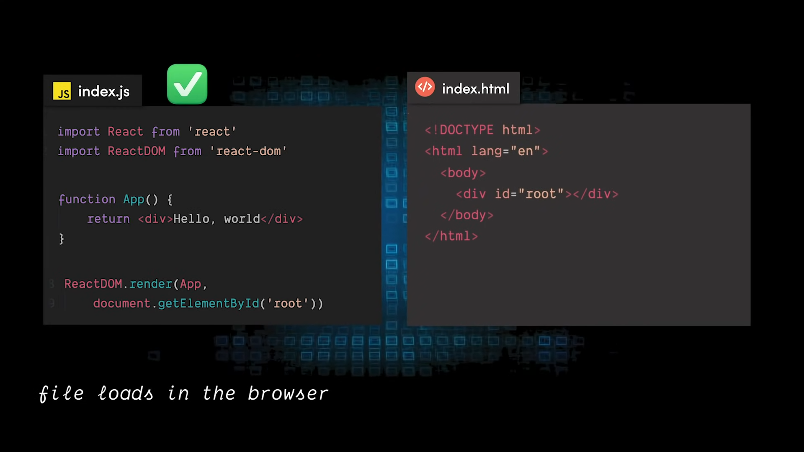
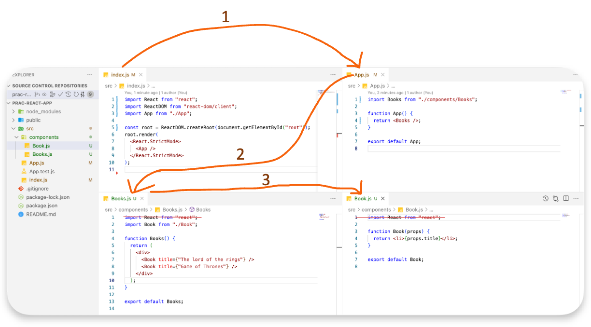
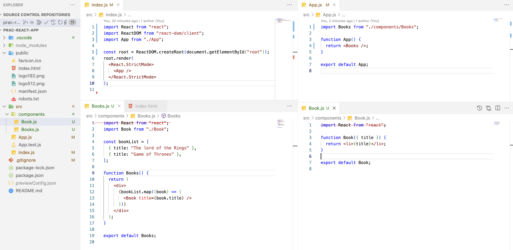
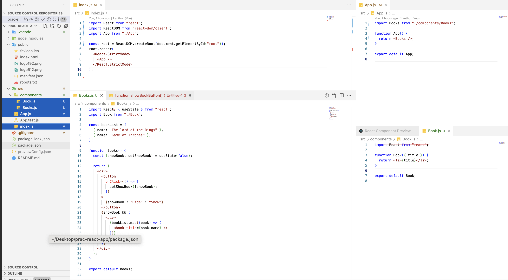

# React

Learn everything about React here.

## Overview

- Default library/framework for building web applications.
  > Best use case: <kbd>React + NextJS FE</kbd>. We could also use backend API using NextJS, but we can have powerful BE APIs in Rust using Axum may be.
- React components are JavaScript functions that return markup.
- React creates a VIRTUAL DOM in memory.
  > Instead of manipulating the browser's DOM directly, React creates a virtual DOM in memory, where it does all the necessary manipulating, before making the changes in the browser DOM.
- React only changes what needs to be changed!
  > React finds out what changes have been made, and changes only what needs to be changed.
- **Real vs Virtual DOM**
  - Frequent DOM manipulations are expensive and performance heavy.
  - Virtual DOM is a virtual representation of the real DOM.
  - When state changes occur, the virtual DOM is updated and the previous and current version of virtual DOM is compared. This is called “diffing”.
  - The virtual DOM then sends a batch update to the real DOM to update the UI.
  - React uses virtual DOM to enhance its performance.
  - It uses the observable to detect state and prop changes.
  - React uses an efficient diff algorithm to compare the versions of virtual DOM.
  - It then makes sure that batched updates are sent to the real DOM for repainting or re-rendering of the UI.

## Installation

- `nvm`, `npm`, `node`(in sequence)
  > Instead of `npm`, one can use `yarn`, `pnpm`, `bun` (my fav. ❤️), etc.
- Create react project: There are many types to kickstart this:
  - **React App**: Add a React project using `$ npx create-react-app my-app` (where `my-app` is the name of your project).
    > 💡 Don't install `create-react-app` globally.
  - **Using Vite** (fast enough): Look at this project done: [todo-vite-ts](./todo-vite-ts/)
  - **Using NextJS** (production + fast): Look at part-1 & part-2 in [next-react-course](../nextjs/next-react-course/), [next-react-course-2](../nextjs/next-react-course-2/)
- Add prettier to your project using `$ bun add --dev prettier`.
  - single-quote: `true`
  - semi: `true` (depends on project to project)
- VSCode Extensions:
  - [React Component Preview](https://marketplace.visualstudio.com/items?itemName=SeoJunYoo.react-component-preview)

## My Apps

Learn about each of my apps in the "**About**" section.

> All the apps will be available in form of folders.

1. [My App](./my-app/README.md)
2. [Starting React](./starting-react/README.md)

## Run/Deploy

- Run `$ bun start` to start the development server.
- Run `$ bun run build` to create a production build.
- Deploy the build folder to a static hosting service like **Netlify** or **Vercel**.

## Concepts

### How it works

1. Step-1: Loads the `index.html` file.
   
2. Step-2: finds the root element with `id="root"`.
   

3. Step-3: Then, `.render` is called on the `ReactDOM` object.
   

4. Step-4: trying to replace everything inside App into the root element.
   

### File structure

```console
❯ tree -I node_modules
.
├── README.md
├── package-lock.json
├── package.json
├── public
│   ├── favicon.ico
│   ├── index.html
│   ├── logo192.png
│   ├── logo512.png
│   ├── manifest.json
│   └── robots.txt
└── src
    ├── App.css
    ├── App.js
    ├── App.test.js
    ├── index.css
    ├── index.js
    ├── logo.svg
    ├── reportWebVitals.js
    └── setupTests.js
```

### Imports

These are the imports you need to use React.

```jsx
import React from "react";
import ReactDOM from "react-dom";
```

### Execute

```jsx
// define function
function App() {
  return <h1>Hello World to `my-app`</h1>;
}

// execute function
ReactDOM.render(App, document.getElementById("root"));
```

### Component

Component are the building blocks of React apps. They have JSX (JS XML) markup and JavaScript logic.

A component follows this order:
<details><summary><b>Expand:</b></summary>

```tsx
/* Props type check */
interface TodoItemProps {
  id: string
  title: string
  isCompleted: boolean
  deleteTodo: (id: string) => void
  toggleTodo: (id: string, isCompleted: boolean) => void
}


export default function TodoItem({
  id,
  title,
  isCompleted,
  deleteTodo,
  toggleTodo,
}: TodoItemProps) {
  /* react state */
  const [newTitle, setNewTitle] = useState('')

  /* react hooks using `useEffects` */
  useEffect(() => {
  })

  /* functions */
  const handleDelete = () => {
  }

  /* return */
  return (
    <>
    // put the JSX here
    </>
  )
}
```

</details>

A component can contain components & it goes recursively.


---

### JSX


gets flipped to JS when curly braces is used:


Key differences:

- **JSX** uses `className` instead of `class`.
- **JSX** uses `htmlFor` instead of `for`. E.g. In a form, connecting element to a label using `htmlFor`.
- Always put the JS/TS code inside `{}` (curly braces) in between the elements.
- `onClick` instead of `onclick` listener like this:

```jsx
<button onClick={() => console.log("clicked")}>Click</button>
```

---

Since, JSX isn't real JS, so a package `webpack` is used to convert JSX to JS.


---

**JSX** is stricter than **HTML**. You have to close tags like `<br />`. Your component also can’t return multiple **JSX** tags. You have to wrap them into a shared parent, like a `<div>...</div>` or an empty `<>...</>` wrapper.

---

If you add a **classname** to a component, you have to use add the style for the same in the CSS file (with same name like for `App.js`, `App.css`).

> `class` is replaced by `className` in JSX. So, here my-button is the className which is defined in the CSS filename same as the JS filename.

```jsx
// App.js
function MyButton() {
  return <button className="my-button">My Button</button>;
}

function App() {
  return (
    <div>
      <h1>Hello World to `my-app`</h1>
      <MyButton />
    </div>
  );
}
```

```css
/* App.css */
.my-button {
  background-color: #4caf50; /* Green */
  border: none;
  color: white;
  padding: 15px 32px;
  text-align: center;
  text-decoration: none;
  display: inline-block;
  font-size: 16px;
  margin: 4px 2px;
  cursor: pointer;
}
```

---

The style can be used in JSX when your styles depend on JS variables.

```jsx
// App.js

```

---

The information you pass down like this is called **props**. Now the MyApp component contains the count state and the handleClick event handler, and passes both of them down as props to each of the buttons.

Finally, change MyButton to read the props you have passed from its parent component:

```jsx
// App.js
// props: count, onClick
function MyButton({ count, onClick }) {
  return <button onClick={onClick}>Clicked {count} times</button>;
}
```

---

Each child in a list should have a unique `key` prop.

otherwise, it will throw error like this:


Solution:

```jsx
// App.js
function MyList() {
  const list = ["a", "b", "c"];
  return (
    <ul>
      {list.map((item) => (
        <li key={item}>{item}</li>
      ))}
    </ul>
  );
}
```

### State

State is a way to store data in a component. It is similar to props, but it is private and fully controlled by the component.

```jsx
const [showBook, setShowBook] = useState(false);
```


When application becomes very big, then the state management is done using either `Redux` or `ReactContext`.

## Examples

1. Use component props to pass data to a component.

   

2. next version of (1)

   

   > `props` in arg is changed to {title}

3. Use `map` to render the books in the same example. No need to write the `<Book/>` component again and again for a long list of books.

   

4. Not necessarily the dictionary key in Book has to be `title`. So, instead changed the list's key to `name`:

   

All these versions output the same result as:


---

1. Use `useState` to change the state of the component. Here, show/hide the book based on clicked (via `setShowBook()` function) status maintained in `showBook` param.

   

2. Revised code for (1): the html logic are moved to 2 functions & then those functions are called. More professional expression.

   

All these versions output the same result as:


## Tools

- [BuilderX](https://builderx.io/app/): No-code React UI builder like Android Studio.
- [Anima App](https://www.animaapp.com/): Alternative to BuilderX.
- [Locofy.ai](https://www.locofy.ai/): Create React apps with no code. Just import your design and get a React FE code.

## References

### Education

- [React](https://facebook.github.io/react/)
- [Learn React](https://beta.reactjs.org/learn)
- [React + TS](https://youtube.com/playlist?list=PLNqp92_EXZBJ4CBroxVBJEpAXoz1g-naZ)
- [react-tutorial.app](https://react-tutorial.app/) [PURCHASED]

## Videos

- [Learn React With This One Project](https://www.youtube.com/watch?v=Rh3tobg7hEo) ✅
- [React Crash Course 2024](https://youtu.be/LDB4uaJ87e0?si=zIBjeaAksOnYiM83) `3-hr` ⏰

### Component Libraries

- [Github | `awesome-react-components`](https://github.com/brillout/awesome-react-components)
- [CogoToast](https://cogoport.github.io/cogo-toast/)
- [Chakra UI](https://v2.chakra-ui.com/)
