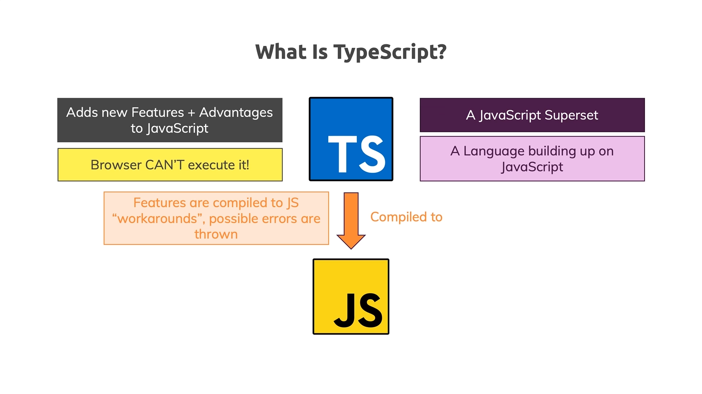
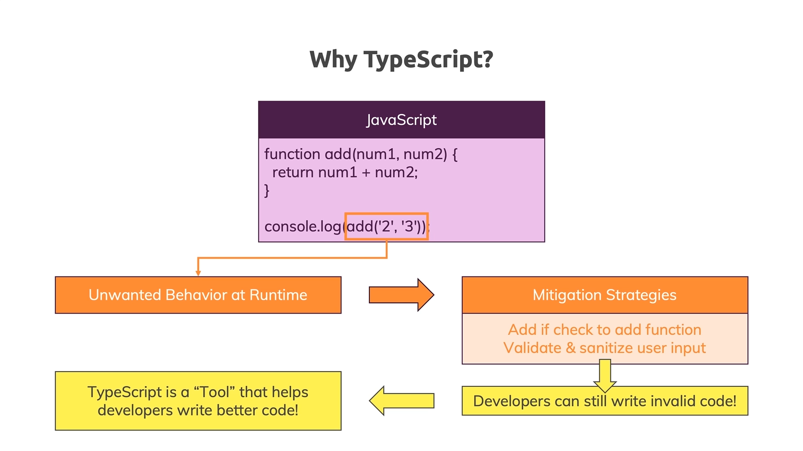
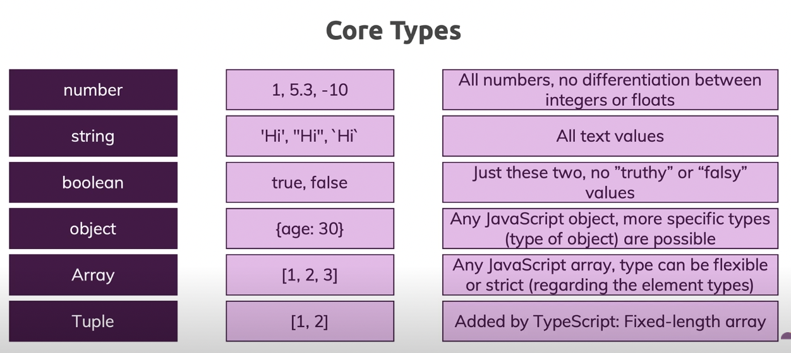
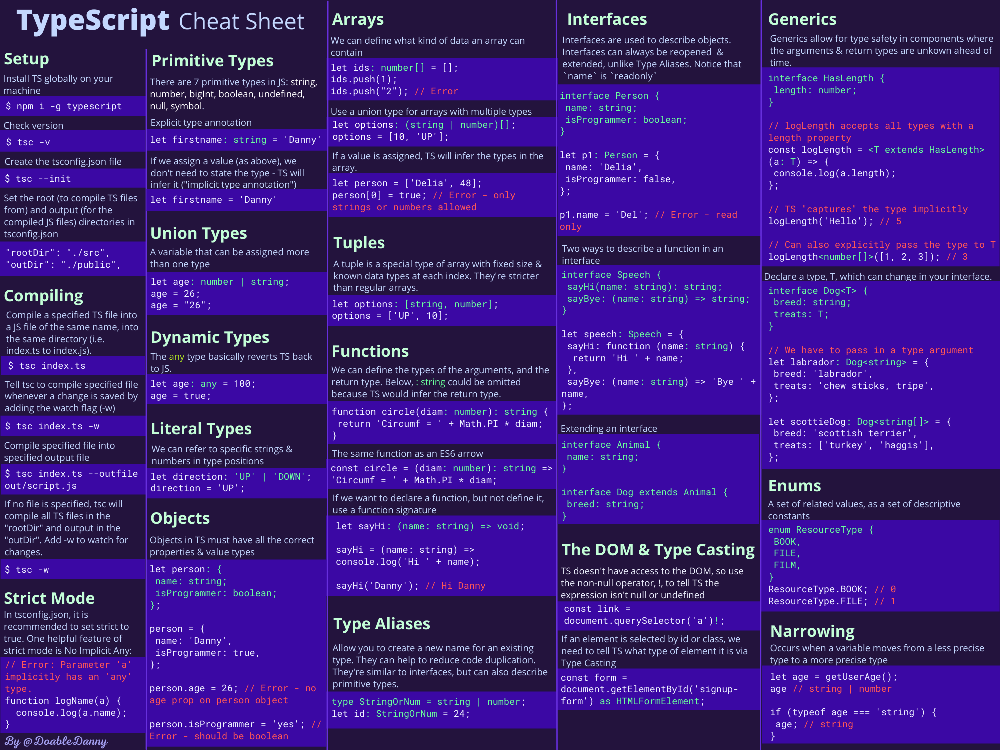

# Lean Typescript

My Learning on Typescript.

## Concepts

- [What is Typescript](https://www.youtube.com/watch?v=BwuLxPH8IDs&t=117s)
  

- [Why Typescript](https://www.youtube.com/watch?v=BwuLxPH8IDs&t=295s)
  

- Browsers can't execute TypeScript, but JavaScript, hence all the `.ts` code has to be compiled down to `.js`
- TypeScript is a typed superset of JavaScript that compiles to plain JavaScript.
- It offers classes, modules, and interfaces to help you build robust components.
- For React, JS is used which is achieved by compiling typescript. Hence, a safer JS rather than hardcoding JS w/o static typing.
- The compiler is `tsc`. This is used to transpile `.ts` file to `.js`
- When defining a variable, prefer using `const` than `let` unless you want to change the value of the variable. This is because, `const` is immutable. Hence, it's better to use `const` than `let` for safety. The same pattern is also followed in 'Rust' programming language using `let` (immutable) & `let mut` (mutable).
- Types
  
- In TypeScript, the code can be made to look like without defining specific type like JS by declaring variables as `any`. We can skip the type declaration in TS using a boilerplate with `tsconfig.json` file. That takes care of the type declaration. Follow this [ts-boilerplate repo](https://github.com/abhi3700/ts-boilerplate).
- The idea is to throw unexpected error at compile-time not during run-time.
- Prefer using `===` instead of `==` in typescript.

  - `===` checks the types of both sides first & then the value. In TS, `==` would also work in similar way.
  - `==` sometimes might give an unexpected result.

  So, it's better to use `===` than `==` in TS.

  E.g.

  ```ts
  let str = "1";
  let num = 1;

  console.log(str == num);
  ```

  After compile,

  ```console
  comparisons.ts:4:13 - error TS2367: This condition will always return 'false' since the types 'string' and 'number' have no overlap.

  4 console.log(str == num);
                ~~~~~~~~~~

  Found 1 error.
  ```

  Hence, it's not wrong to use `==`. But, still for safety use `===` over `==`

---

- [String vs string](https://dev.to/josiasaurel/the-difference-between-string-and-string-in-typescript-4mf2)

  Prefer using `String` as a class like wrapping something as string:

  ```ts
  BigNumber.from(String(1e10));
  ```

  whereas `string` should be used for variables defined just as `string`.

---

- [Types vs Interfaces](https://blog.logrocket.com/types-vs-interfaces-in-typescript/)

  <details>

  <summary><b>Code:</b></summary>

  ```ts
  type Man {
    age: number
  }

  type Woman {
    age: number
  }

  type Person: Man | Woman
  ```

  ```ts
  interface Name {
    name: string
  }

  interface Age {
    age: number
  }

  interface Person: Name & Age
  ```

  </details>

  try to use `interface` generally.

## Installation

### MacOS

**Install**:

```sh
# globally
$ npm install -g typescript

# locally into devDependencies
$ npm install --save-dev typescript

# locally into dependencies
$ npm install --save typescript
```

**Update**:

```sh
npm update -g typescript
```

**Uninstall**:

```sh
# globally
npm uninstall -g typescript

# locally from devDependencies
npm uninstall --save-dev typescript

# locally from dependencies
npm uninstall --save typescript
```

### Package Manager

**NPM vs Yarn**

| Topic                                       | npm                              | yarn                         |
| ------------------------------------------- | -------------------------------- | ---------------------------- |
| Installation                                | serial i.e. slow                 | parallel i.e. fast           |
| Show list of commands                       | npm                              | yarn                         |
| Initialize a project                        | npm init                         | yarn init                    |
| Install dependencies from `package.json`    | npm install                      | yarn                         |
| Install a package and add to `package.json` | npm install <package> --save     | yarn add <package>           |
| Install a devDependency                     | npm install <package> --save-dev | yarn add <package> --dev     |
| Remove a dependency                         | npm uninstall <package> --save   | yarn remove <package>        |
| Upgrade package to its latest version       | npm update --save                | yarn upgrade                 |
| Install a package globally                  | npm install <package> -g         | yarn global add <package>    |
| Uninstall a package globally                | npm uninstall <package> -g       | yarn global remove <package> |

## TS Boilerplate

[Binary repo](https://github.com/abhi3700/ts-boilerplate).

[Lib repo](https://github.com/abhi3700/ts-boilerplate).

## TS Playground

[play here](./playground/)

## Getting Started

> Instead try [boilerplate](#ts-boilerplate).

1. Write code

   ```ts
   let h = "Hello World";
   console.log(h);
   ```

2. Transpile code

   ```sh
   # M-1
   tsc hello.ts
   # generates a `hello.js` file

   # M-2
   tsc hello.ts --outFile hello
   # generates a `hello` file
   ```

3. Print code

   ```sh
   node hello.js

   // OR

   node hello
   ```

## Cheatsheet



## Troubleshoot

### 1. Error: `error TS2304: Cannot find name 'unknown'.`

- Solution:

```ts
declare global {
  type unknown = any;
}
```

### 2. Error: `Not able to print Promise <pending> result`

- Before:

```ts
const eoslime = require("eoslime");

// a promise pending funciton
const randomName = eoslime.utils.randomName();
console.log("Random name: " + randomName); // => Random name: [object Promise]
```

- Reason: The promise will always log pending as long as its results are not resolved yet. You must call .then on the promise to capture the results regardless of the promise state (resolved or still pending) [source](https://stackoverflow.com/a/38884856/6774636).
- After:

```ts
const eoslime = require("eoslime");

// a promise pending funciton
const randomName = eoslime.utils.randomName();
randomName.then(function (result) {
  console.log("Random name: " + result); // => Random name: lfb3a45e344e
});
```

### 3. Error: `Cannot find module '../../abi/WTsscLz.json'. Consider using '--resolveJsonModule' to import module with '.json' extension.`

- Cause: In `tsconfig.json`, it's not enabled to resolve json modules. The error message you're encountering indicates that TypeScript is unable to locate and import the JSON file `../../abi/WTsscLz.json`. By default, TypeScript does not handle `.json` files as modules, which means you cannot import them directly without some additional configuration.

- Solution: Here's what you should do:

1. Locate your `tsconfig.json` file in the root of your TypeScript project.
2. Add or modify the `compilerOptions` section to include `"resolveJsonModule": true`.

Your `tsconfig.json` should look something like this:

```json
{
  "compilerOptions": {
    // ... other options ...
    "resolveJsonModule": true,
    "esModuleInterop": true,
    "moduleResolution": "node"
    // ... other options ...
  }
  // ... potentially other sections ...
}
```

And the changes in typescript file:

```diff
-import {} from '../../abi/WTsscLz.json';
+import WTsscLz from '../../abi/WTsscLz.json';
```

## Repositories

- TS Unit Tests Setup - <https://github.com/ChiragRupani/TSUnitTestsSetup>

### References

- [TypeScript tutorial in Visual Studio Code](https://code.visualstudio.com/docs/typescript/typescript-tutorial)
- [TypeScript Best Practices — Semicolons and Spacing](https://levelup.gitconnected.com/typescript-best-practices-semicolons-and-spacing-5be9c5963604)
- [Typescript Exercise](https://github.com/typescript-exercises/typescript-exercises/tree/master/src/exercises)
- [Clean code Typescript](https://github.com/labs42io/clean-code-typescript)
- [Understanding `promise` before you start with `async/await`](https://bluepnume.medium.com/learn-about-promises-before-you-start-using-async-await-eb148164a9c8)
- [Writing unit tests in TypeScript](https://chiragrupani.medium.com/writing-unit-tests-in-typescript-d4719b8a0a40)
- [Top 50 Typescript Interview Questions And Answer for 2021](https://www.simplilearn.com/tutorials/typescript-tutorial/typescript-interview-questions)
- [TypeScript Course for Beginners 2021 - Learn TypeScript from Scratch!](https://www.youtube.com/watch?v=BwuLxPH8IDs)
